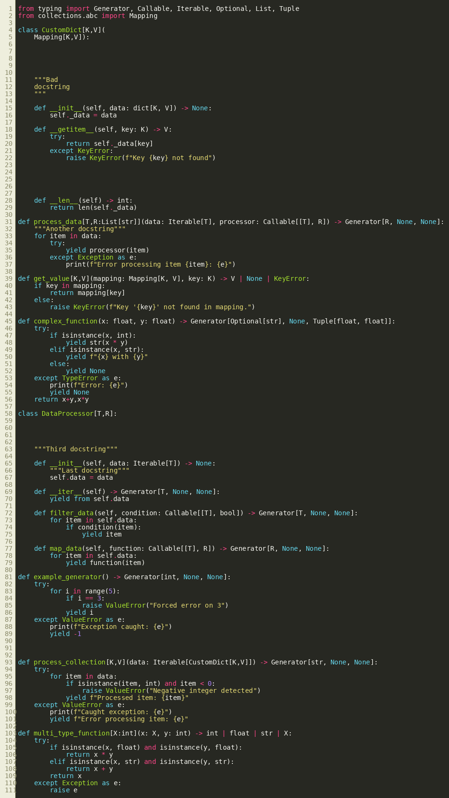
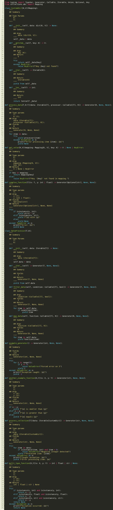

# DocStringGenerator
A Python docstring template generator with type hints.

*Tested for 3.12 but will work for older versions in most cases*

- [Installation](#installation)

    run: `pip install git+https://github.com/mrSWE3/DocStringGenerator.git`
- [Usage](#usage)

    #### Add docstring template to a.py 
    
    `docstrgen a.py `

    #### Add docstring template to a.py but save in b.py

    `docstrgen a.py -o b.py`

    #### Add docstring template to a.py and replace existing docstrings

    `docstrgen a.py -f`

  
  

