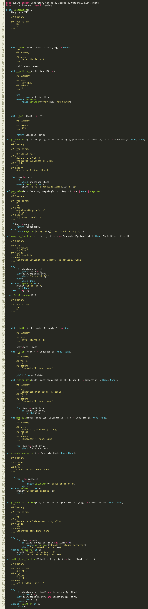

- [Installation](#installation)

    run: pip install git+https://github.com/mrSWE3/DocStringGenerator.git
- [Usage](#usage)

    >Add docstring template to a.py 
    
    docstrgen a.py  

    >Add docstring template to a.py but save in b.py

    docstrgen a.py -o b.py

    >Generate docstrings even if they already exists to a.py

    docstrgen a.py -f

  
  

